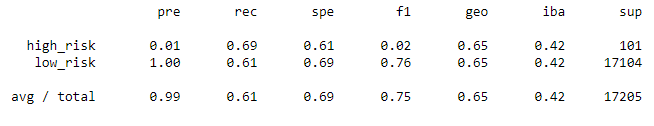
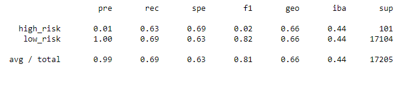
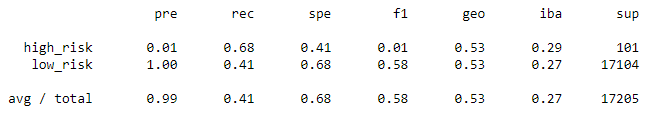
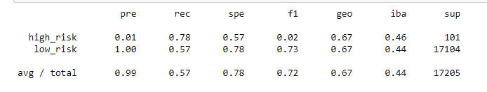
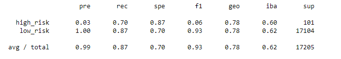
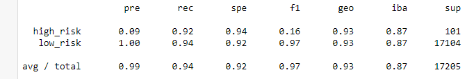

# Credit_Risk_Analysis

## Overview of the Analysis
The purpose of this analysis to apply machine learning to sovle real-world challenge: credit card risk. Different techniques were employed to train and evaluate models with unbalanced classes. In this anlaysis, RandomOverSampler and SMOTE algorithms will be used to oversample the data, ClusterCentroids will be used to undersample the data. Then, a combinatorial approach of over and undersampling will be conducted with SMOTEENN algorithm. Next, the two new machine learning models that reduce bias, BalancedRandomForestClassifier and EasyEnsembleClassifer, to predict credit risk.

## Results

### Native Oversampling
- With the Native Random Oversampling, the balanced accuracy score is 0.65.
- With the confusion matrix below, the high risk applications has a precision of 0.01, recall of 0.69, and f1 score of 0.02.
- With the confusion matrix below, the low risk applications has a precision of 1.00, recall of 0.61, and f1 score of 0.76

### SMOTE Oversampling
- With the SMOTE Oversampling, the balanced accuracy score is 0.66.
- With the confusion matrix below, the high risk applications has a precision of 0.01, recall of 0.63, and f1 score of 0.02.
- With the confusion matrix below, the low risk applications has a precision of 1.00, recall of 0.69, and f1 score of 0.82

### Under Sampling with Cluster Centroid
- With the Under sampling, the balanced accuracy score is 0.55.
- With the confusion matrix below, the high risk applications has a precision of 0.01, recall of 0.68, and f1 score of 0.01.
- With the confusion matrix below, the low risk applications has a precision of 1.00, recall of 0.41, and f1 score of 0.58.

### Combination_Sampling (Over and Under Sampling)
- With the Under sampling, the balanced accuracy score is 0.68.
- With the confusion matrix below, the high risk applications has a precision of 0.01, recall of 0.78, and f1 score of 0.02.
- With the confusion matrix below, the low risk applications has a precision of 1.00, recall of 0.57, and f1 score of 0.73.

### Balanced Random Forest Classifier
- With the Balanced Random Forest Classifier, the balanced accuracy score is 0.79
- With the confusion matrix below, the high risk applications has a precision of 0.03, recall of 0.70, and f1 score of 0.06.
- With the confusion matrix below, the low risk applications has a precision of 1.00, recall of 0.87, and f1 score of 0.93.

### Easy_Ensemble_AdaBoost_Classifier
- With the Balanced Random Forest Classifier, the balanced accuracy score is 0.93
- With the confusion matrix below, the high risk applications has a precision of 0.09, recall of 0.92, and f1 score of 0.16.
- With the confusion matrix below, the low risk applications has a precision of 1.00, recall of 0.94, and f1 score of 0.97.

## Summary
